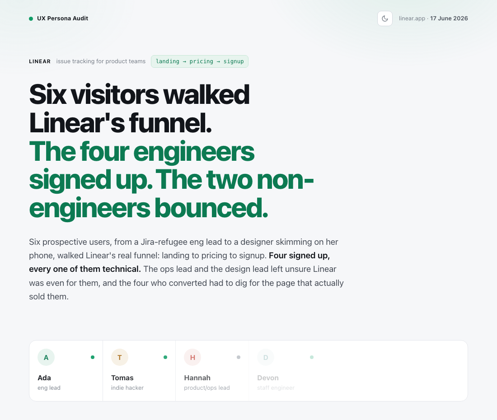
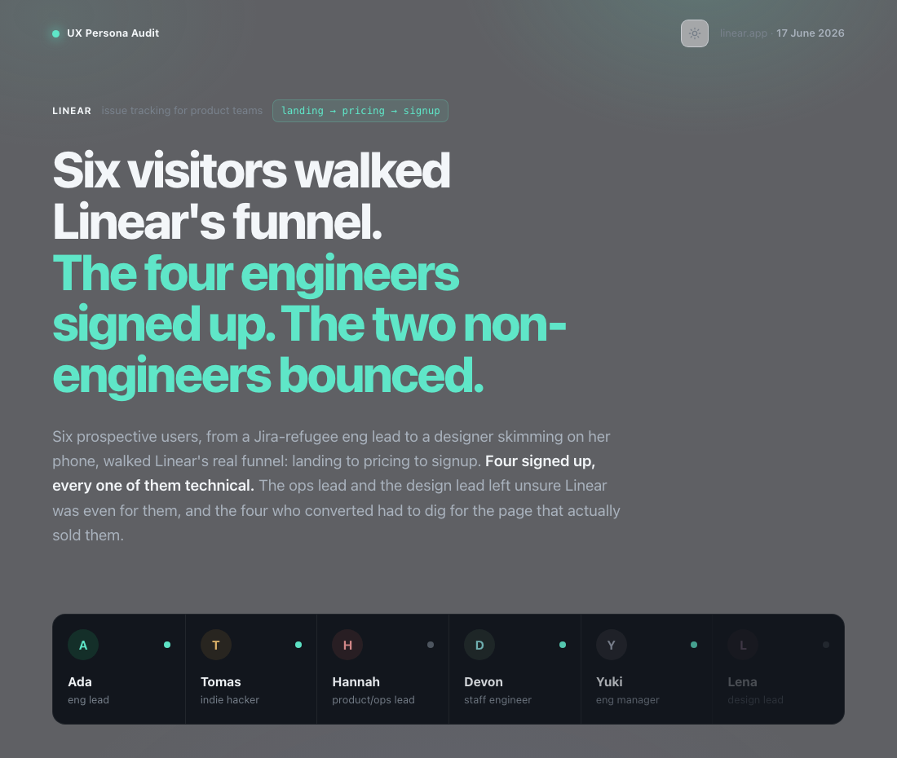
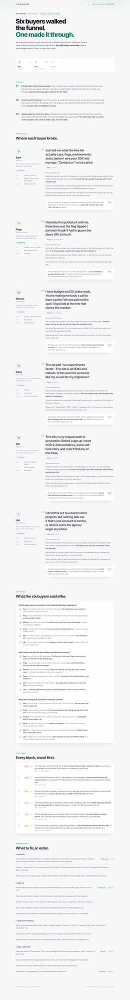
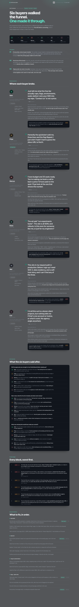

# ux-persona-audit

A [Claude Code](https://claude.com/claude-code) skill that audits a website's UX the
way real traffic actually hits it: not as one average visitor, but as a *panel* of
deliberately different people. A skeptic from Google, an impatient indie hacker off
an X thread, an anxious first-timer from an Instagram reel, a referral, a direct
visit. Each persona walks the real pages in parallel, thinks aloud, logs where they
stall or backtrack, and the skill synthesizes it all into one standalone HTML report.

<p align="center">
  
  
</p>

<p align="center"><em>A real run against linear.app, light and dark. Toggle lives in the header.</em></p>

<p align="center"><strong><a href="https://vxncxnx.github.io/ux-persona-audit/">Open a live report →</a></strong> &nbsp;no clone, no install, just look</p>

## Why a panel

A page that is obvious to one person is opaque to another, and the difference is
mostly where they came from and what they came for, not their age. This is a scaled
**cognitive walkthrough** layered with **Nielsen's heuristics** and
**jobs-to-be-done**. Nielsen Norman research is the reason for the size: about ten
testers surface the large majority of usability issues, so six to eight diverse
personas hit the sweet spot of coverage without noise.

## What you get

A single self-contained HTML file (inline CSS and JS, no network calls, light and
dark themes, prints clean) with:

- a **headline verdict** that states the outcome up front, plus a 3-line "pattern"
  naming the biggest cross-persona problems;
- a **cast strip** of the whole panel, each with a converted / dropped marker;
- **per-persona blocks**: a verbatim pull-quote in their own voice, ranked fixes, and
  their top friction with an `S1`–`S4` severity tag;
- a **friction ledger**: every top friction, ranked worst-first, so the priority is
  obvious;
- an **exit interview**: every persona answers the same handful of post-walkthrough
  questions (did the pages earn their trust, was free-vs-paid clear, what almost made
  them leave, would they pay), grouped per question so the panel's agreement or split
  is obvious at a glance;
- consolidated **SEO / UX / nomenclature / quick-win briefs** with impact and effort
  chips on the highest-leverage items.

The report is written in English by default for a global audience; localize the whole
thing through the `ui` strings when you need another language.

## Quickstart

Install with the [Skills CLI](https://github.com/vercel-labs/skills):

```bash
npx skills add VXNCXNX/ux-persona-audit -g
```

(or drop this folder into `~/.claude/skills/` by hand).

> **Compatibility:** tested on Claude Code today. The skill is plain Markdown plus a
> dependency-free Node build script, so it should travel to other skill-aware harnesses,
> and broader support is coming. If your setup needs a tweak, open an issue.

Then just ask Claude:

> Audit the UX of example.com with a panel of personas.
> Where do visitors get stuck on my landing page?
> Test my pricing flow as different kinds of buyers.

The skill scopes the flow, recons the real pages, generates a persona panel,
**asks you to confirm the personas fit your real audience**, saves them for reuse,
runs one subagent per persona in parallel, and renders the report.

### Navigation backends

It picks the highest-fidelity option available at runtime, no house-specific tools
assumed:

1. a connected **Playwright or browser MCP**: personas navigate click by click;
2. **WebFetch** (always available): personas fetch each page and reason the
   transitions. This is the default when no browser tool is connected.

The report states which was used. A reasoned (fetch) walkthrough is labeled as such,
never dressed up as click-tested.

### Subagent model and your plan

Before the parallel walkthroughs, the skill asks whether to run the persona
subagents on **Sonnet** (the default) or **Opus**. Sonnet is fast and works on any
plan, including Claude Pro. Opus gives richer in-character reasoning, but it fans out
6 to 8 agents at once, so it needs a **Max 5x plan at the bare minimum** (Max 20x to
be comfortable); on a smaller plan it will hit usage limits partway through the panel
and stall the audit. When in doubt, keep Sonnet, the heavy synthesis runs on your
main model either way.

## Try the sample without running an audit

```bash
node scripts/build_report.mjs assets/sample-data.json -o /tmp/ux-audit-demo.html
open /tmp/ux-audit-demo.html   # xdg-open on Linux
```

`assets/sample-data.json` is a full worked example (six personas auditing a fictional
SaaS funnel) and doubles as the authoring reference for the report-data shape.

<p align="center">
  
  
</p>

<p align="center"><em>The bundled sample, rendered, light and dark.</em></p>

## Honest by design

- Personas use only what the pages actually show. The gaps are the findings.
- On a JavaScript single-page app, a fetch sees the non-hydrated shell. The skill
  treats that as missing data and flags it "unverified, needs a real browser" rather
  than inventing a bug.
- During an audit the personas observe up to the action; they never submit forms,
  sign up, or check out on a live site.
- Validations count. If the flow works for a segment, the report says so.

## Files

| Path | What it is |
| --- | --- |
| `SKILL.md` | the pipeline Claude follows |
| `references/persona-schema.md` | persona traits, and which ones change behavior |
| `references/friction-taxonomy.md` | friction categories and the S1–S4 scale |
| `references/report-structure.md` | the report-data JSON contract |
| `assets/report-template.html` | the standalone, data-driven report |
| `assets/sample-data.json` | a full worked example |
| `scripts/build_report.mjs` | injects data into the template (Node, no deps) |
| `test/smoke.mjs` | `node test/smoke.mjs` |

## License

MIT. Use it, fork it, share it.
